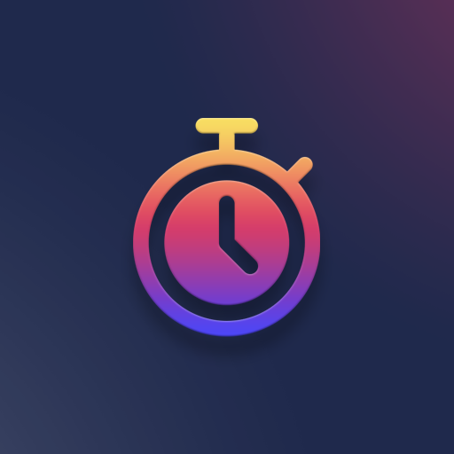

<h1 align="center">Stopwatch</h1>
<p align="center"></p>
<p align="center"><i>A Discord bot for managing slowmode.</i></p>
<p align="center">
<a href="https://github.com/BrackeysBot/Stopwatch/releases"></a>
<a href="https://github.com/BrackeysBot/Stopwatch/actions/workflows/dotnet.yml"></a>
<a href="https://github.com/BrackeysBot/Stopwatch/issues"></a>
<a href="https://github.com/BrackeysBot/Stopwatch/blob/main/LICENSE.md"></a>
</p>

## About
Stopwatch is a Discord bot which manages slowmode in text channels.

## Installing and configuring Stopwatch 
Stopwatch runs in a Docker container, and there is a [docker-compose.yaml](docker-compose.yaml) file which simplifies this process.

### Clone the repository
To start off, clone the repository into your desired directory:
```bash
git clone https://github.com/BrackeysBot/Stopwatch.git
```
Step into the Stopwatch directory using `cd Stopwatch`, and continue with the steps below.

### Setting things up
The bot's token is passed to the container using the `DISCORD_TOKEN` environment variable. Create a file named `.env`, and add the following line:
```
DISCORD_TOKEN=your_token_here
```

Two directories are required to exist for Docker compose to mount as container volumes, `data` and `logs`:
```bash
mkdir data
mkdir logs
```
The bot currently makes no use of a configuration file, so while the `data` directory is required, it can be empty.

The `logs` directory is used to store logs in a format similar to that of a Minecraft server. `latest.log` will contain the log for the current day and current execution. All past logs are archived.

The `data` directory is used to store persistent state of the bot, such as config values and the infraction database.

### Launch Stopwatch
To launch Stopwatch, simply run the following commands:
```bash
sudo docker-compose build
sudo docker-compose up --detach
```

## Updating Stopwatch
To update Stopwatch, simply pull the latest changes from the repo and restart the container:
```bash
git pull
sudo docker-compose stop
sudo docker-compose build
sudo docker-compose up --detach
```

## Using Stopwatch
For further usage breakdown and explanation of commands, see [USAGE.md](USAGE.md).

## License
This bot is under the [MIT License](LICENSE.md).

## Disclaimer
This bot is tailored for use within the [Brackeys Discord server](https://discord.gg/brackeys). While this bot is open source and you are free to use it in your own servers, you accept responsibility for any mishaps which may arise from the use of this software. Use at your own risk.
